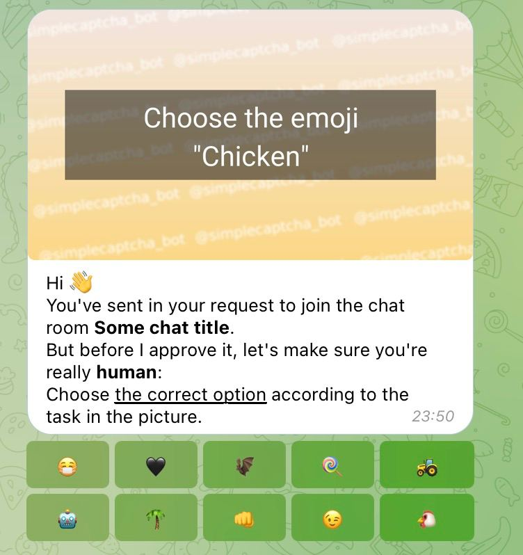

# Simple Captcha Bot

**Simple Captcha Bot** is your best friend when you want to protect your Telegram chat from spammers.

## Features

- Works only in groups with the "request to join" option enabled
- Does not send captcha messages to groups
- Automatically rejects requests if user does not respond to captcha after 2 minutes

## Tech Stack
- [Aiogram](https://github.com/aiogram/aiogram) v3.0.0b3 - framework for Telegram Bot API
- [Redis](https://redis.io>) v7.0 - storage of temporary data and scheduled tasks
- [Arq](https://github.com/samuelcolvin/arq>) v0.22 - scheduler

## Installation

1. `git clone https://github.com/prostmich/simplecaptcha-bot.git`
2. `cd simplecaptcha-bot`
3. Rename `congig_example.ini` to `config.ini`
4. Fill in `config.ini` with your credentials (if you do not want to use webhooks, do not fill in the `webhook` section)
6. Set the Redis password in `redis.conf`

## Usage
Run `docker-compose up -d` to start.